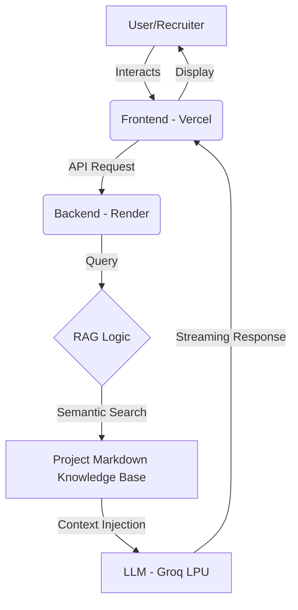

# 🚀 AI-Powered Professional Portfolio & RAG Assistant

This is a high-performance, full-stack portfolio website integrated with a Retrieval-Augmented Generation (RAG) chatbot. Unlike static portfolios, this site features an intelligent assistant that is "trained" on my specific project documentation, resume, and technical skills to provide grounded, real-time answers to recruiters.

---

## 🏗️ System Architecture

The project follows a decoupled architecture for maximum scalability and speed.

- **Frontend:** Built with a responsive, modern UI and hosted on Vercel for global edge delivery.
- **Backend:** A Flask-based REST API hosted on Render that handles chat sessions and RAG logic.
- **Knowledge Base:** A curated set of `.md` files (`project.md`, `skills.md`) containing detailed metrics and technical deep-dives.
- **Inference Engine:** Utilizes the Groq LPU (Language Processing Unit) for sub-300ms response times.

---

## ✨ Key Features

- **RAG-Powered Chatbot:** "Ask My AI" can answer specific questions about my skills or my projects — without hallucinating.
- **Ultra-Low Latency:** Optimized token streaming via Groq API, delivering responses faster than traditional LLM interfaces.
- **Detailed Project Catalog:** Interactive sections for CV, GenAI, and Data Science projects with "Problem → Approach → Result" writeups.
- **Responsive UI:** Fully optimized for mobile, tablet, and desktop viewing with smooth animations and professional icons.
- **Automated Deployment:** CI/CD pipeline integrated with GitHub for instant updates to both Frontend and Backend.

---

## 🛠️ Technical Stack

| Layer | Technology |
|---|---|
| Frontend | HTML5, CSS3, JavaScript (ES6+), FontAwesome Icons |
| Backend | Python, Flask, Gunicorn |
| AI/LLM | Groq Cloud API (Llama 3 / Mixtral), LangChain (RAG) |
| Hosting | Vercel (Frontend), Vercel (Backend) |
| Documentation | Markdown (Base for RAG Knowledge) |

---

## 🚀 How It Was Made (The Process)

### Phase 1: Knowledge Engineering

I created a structured "Source of Truth" by writing detailed Markdown files. I ensured metrics were consistent to prevent the AI from giving conflicting answers.

### Phase 2: Backend Development

I built a Flask API to serve as the bridge. It takes a user's question, searches the Markdown files for relevant "context," and sends both the question and context to the LLM.

### Phase 3: Frontend & UI/UX

I designed a clean, dark-themed UI that emphasizes "Scannability." I used FontAwesome for visual cues and built a custom chat widget that handles streaming text.

### Phase 4: Deployment

The frontend was deployed to Vercel for fast loading, while the Python backend was deployed to Render. I configured CORS (Cross-Origin Resource Sharing) to allow secure communication between the two domains.

---

## 📖 How to Access & Use

**The Website:** Simply visit the [Live Demo](https://ankit-sharma-sigma.vercel.app/) to view my skills and resume.

**The Chatbot:** Use the floating chat icon on the bottom right.

**Example Queries:**
- "What was your role in the Gait Recognition project?"
- "Tell me about your Brain Tumor model."
- "What technologies did you use for Heal-Bridge AI?"

---

## 👨‍💻 Project Owner

**Ankit Sharma**  
B.Tech CSE @ VIT Bhopal (2027 Batch)

